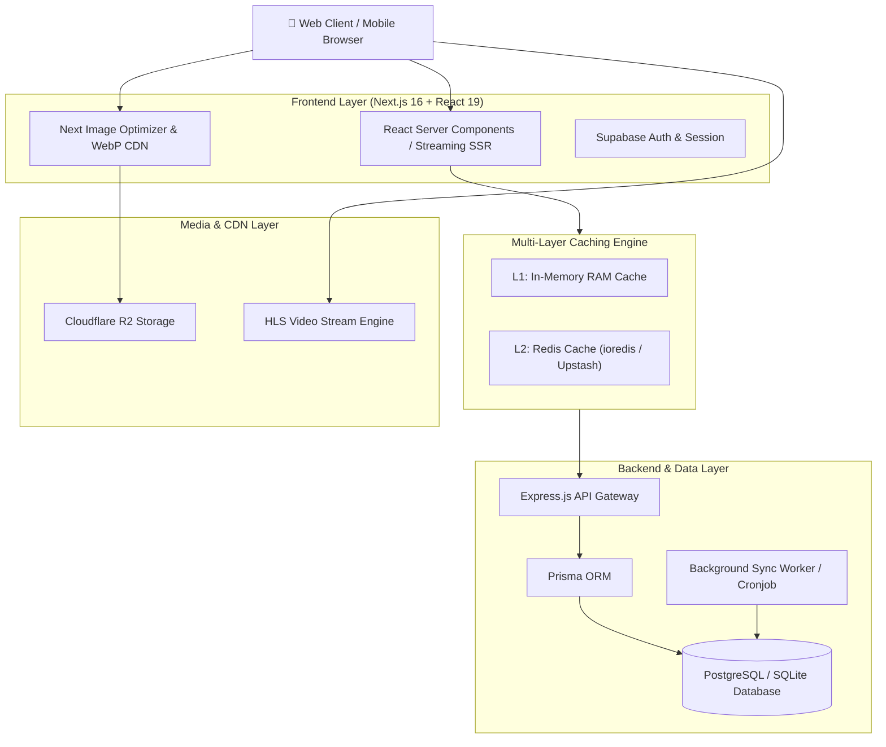

# 🎬 CineStream - Modern Movie Streaming & Discovery Platform (Full-Stack)

<p align="center">
  <strong>Trải nghiệm điện ảnh đỉnh cao với hiệu năng vượt trội, kiến trúc Full-Stack hiện đại, Multi-Layer Caching & Trình phát HLS Video chuyên nghiệp.</strong>
</p>

<p align="center">
  <a href="https://cinestream-demo.vercel.app"><strong>🚀 Live Demo</strong></a> •
  <a href="#-kiến-trúc-hệ-thống-system-architecture"><strong>🏛️ Architecture</strong></a> •
  <a href="#-tính-năng--điểm-nhấn-kỹ-thuật-key-engineering-highlights"><strong>⚡ Tech Highlights</strong></a> •
  <a href="#-hướng-dẫn-cài-đặt-local-getting-started"><strong>🛠️ Getting Started</strong></a>
</p>

<p align="center">
  
  
  
  
  
  
  
  
</p>

---

## 📖 Giới thiệu (Overview)

**CineStream** là nền tảng xem phim và khám phá điện ảnh toàn diện được thiết kế theo kiến trúc **Full-Stack hiện đại**, tập trung tối đa vào **hiệu năng (Performance)**, **trải nghiệm người dùng (UX)** và **khả năng mở rộng (Scalability)**:

- **Frontend**: Xây dựng bằng **Next.js 16 (App Router)** và **React 19**, áp dụng Server Components, Streaming SSR và tối ưu hóa Core Web Vitals.
- **Backend & Data Pipeline**: Node.js / Express / Prisma ORM phục vụ API catalog và hệ thống background worker đồng bộ dữ liệu định kỳ.
- **Bộ nhớ đệm đa tầng**: Kết hợp RAM Cache L1 và Redis L2 giúp giảm độ trễ phản hồi API xuống dưới **10ms**.

---

## 🏛️ Kiến trúc hệ thống (System Architecture)



---

## ⚡ Tính năng & Điểm nhấn kỹ thuật (Key Engineering Highlights)

### 🎥 1. Trình phát Video chuyên nghiệp (Artplayer & HLS Adaptive Streaming)
- **Multi-resolution Streaming**: Hỗ trợ HLS (HTTP Live Streaming) thích ứng băng thông và hỗ trợ các máy chủ streaming dự phòng (Failover support).
- **Custom Player Controls**: Tùy chỉnh tốc độ (0.5x - 2x), phím tắt bàn phím, chế độ rạp chiếu (Theater mode), Picture-in-Picture (PiP).
- **Playback State Sync**: Tự động lưu mốc thời gian đang xem vào LocalStorage/Database và tự động chuyển tập tiếp theo khi kết thúc.

### 🚀 2. Hiệu năng & Bộ nhớ đệm Đa tầng (Dual-Layer Caching)
- **L1 RAM Cache + L2 Redis**: Tối ưu hóa API response time, giảm tải 95% áp lực truy vấn trực tiếp vào Database.
- **Incremental Static Regeneration (ISR)**: Tự động tái tạo trang tĩnh ngầm định kỳ, đảm bảo trang tải tức thì (<100ms) trên Vercel / Edge CDN.
- **Smart Image Loader**: Tự động nén và phân phối ảnh WebP qua Cloudflare R2 CDN.

### 🔍 3. Công cụ Tìm kiếm & Lọc thông minh (Smart Search & Filter)
- Hỗ trợ tìm kiếm siêu tốc tiếng Việt có dấu, không dấu, chữ hoa/thường, tên gốc tiếng Anh và slug.
- Bộ lọc đa tiêu chí linh hoạt: Thể loại, quốc gia, năm phát hành, định dạng (Phim lẻ, Phim bộ, Chiếu rạp).

### 🎨 4. Giao diện Điện ảnh Dark Cinema & Micro-Interactions (UI/UX)
- Thiết kế theo tiêu chuẩn Dark Cinema sang trọng, giảm mỏi mắt khi xem phim ban đêm.
- Tương tác mượt mà với **Framer Motion** và thanh trượt cảm ứng đa điểm **Swiper 12**.
- Tương thích 100% trên mọi thiết bị từ Mobile, Tablet đến Desktop và Smart TV.

### 🔐 5. Bảo mật & Xác thực Người dùng (Supabase Auth & Bot Armor)
- Hệ thống tài khoản hoàn chỉnh: Đăng ký, đăng nhập, khôi phục mật khẩu OTP.
- Đồng bộ danh sách yêu thích, xem sau và lịch sử xem phim trên Cloud.
- Tích hợp **Cloudflare Turnstile** chống spam bot và brute-force attacks.

---

## 🛠️ Công nghệ sử dụng (Tech Stack)

| Phân hệ | Công nghệ | Mục đích |
| :--- | :--- | :--- |
| **Frontend Framework** | [Next.js 16](https://nextjs.org/) (App Router), [React 19](https://react.dev/) | SSR, Server Components, Streaming |
| **Styling & UI** | [Tailwind CSS v4](https://tailwindcss.com/), [Framer Motion](https://www.framer.com/motion/), [Lucide](https://lucide.dev/) | Giao diện hiện đại, animation mượt mà |
| **Backend & API** | [Node.js](https://nodejs.org/), [Express.js](https://expressjs.com/), [Prisma ORM](https://www.prisma.io/) | REST API, Quản lý dữ liệu quan hệ |
| **Video Engine** | [Artplayer.js](https://artplayer.org/), [HLS.js](https://github.com/video-dev/hls.js/) | Trình phát video chuyên dụng |
| **Database** | [PostgreSQL](https://www.postgresql.org/) / [Supabase](https://supabase.com/) | Lưu trữ dữ liệu phim và người dùng |
| **Caching Layer** | [Redis](https://redis.io/) / [Upstash Redis](https://upstash.com/) | Bộ nhớ đệm dữ liệu tốc độ cao |
| **Media CDN** | Cloudflare R2 | Phân phối hình ảnh và static assets |
| **Deployment** | Vercel (Frontend), VPS / Docker / PM2 (Backend) | Môi trường triển khai sản phẩm |

---

## 📂 Cấu trúc dự án (Project Structure)

```text
├── app/                       # Ứng dụng Next.js Frontend (App Router)
│   ├── (admin)/               # Phân hệ quản trị (Dashboard, Analytics)
│   ├── (pages)/               # Các trang người dùng (danh-sach, the-loai, phim, xem-sau...)
│   ├── actions/               # Server Actions (Mutations, Form handlers)
│   ├── api/                   # Route Handlers & Internal Proxies
│   ├── components/            # UI Components tái sử dụng (Header, Footer, Player, Sliders)
│   ├── lib/                   # Kết nối Redis, Supabase client/server
│   └── utils/                 # Utility functions (caching, formatting, media helper)
├── backend/                   # 🚀 Dịch vụ Backend & Data Pipeline
│   ├── prisma/                # Schema database & migrations
│   ├── src/
│   │   ├── controllers/       # Xử lý API catalog, chi tiết phim, tìm kiếm
│   │   ├── routes/            # Khai báo endpoint /api/v1/...
│   │   └── services/          # Data Sync worker, Caching service
│   └── package.json           # Cấu hình dependencies Backend
├── public/                    # Static Assets (Logos, icons, banners)
├── next.config.ts             # Cấu hình Next.js (Image remote patterns, headers)
└── package.json               # Cấu hình Frontend
```

---

## 🛠️ Hướng dẫn cài đặt Local (Getting Started)

### 1. Yêu cầu môi trường
- Node.js >= 20.0.0
- npm hoặc pnpm

### 2. Cài đặt và khởi chạy Frontend

```bash
# 1. Clone repository
git clone https://github.com/your-username/cinestream-showcase.git
cd cinestream-showcase

# 2. Cài đặt dependencies
npm install

# 3. Cấu hình biến môi trường
cp .env.example .env.local

# 4. Khởi chạy môi trường phát triển
npm run dev
```

Mở trình duyệt tại `http://localhost:3000` để trải nghiệm ứng dụng.

---

## 📜 Tuyên bố miễn trừ trách nhiệm (Disclaimer)

> **Lưu ý**: Dự án này được phát triển với mục đích **nghiên cứu học thuật và chứng minh năng lực kỹ thuật (Portfolio Demonstration)**. Mọi dữ liệu hình ảnh, thông tin phim được tham chiếu từ các API nguồn mở công khai (như TMDB). Ứng dụng không lưu trữ hay sở hữu bất kỳ tệp tin phương tiện có bản quyền nào trên máy chủ.
